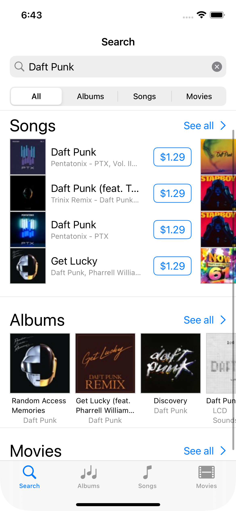
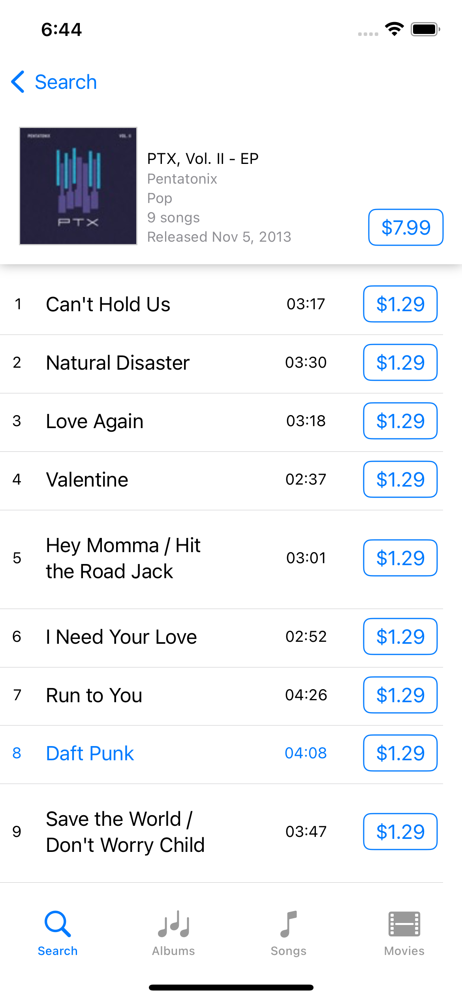
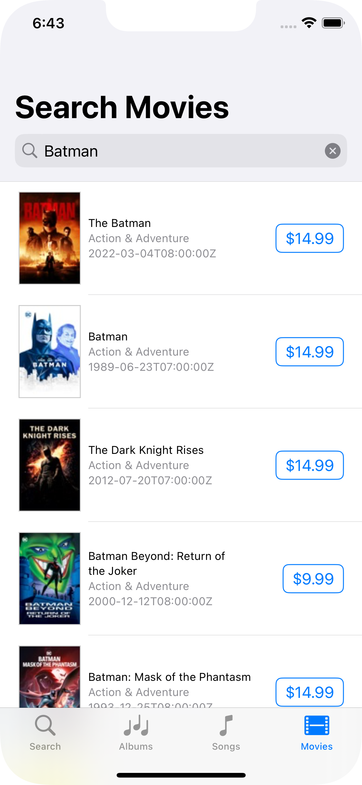

# 📱 iTunes Search App with SwiftUI

An app built in SwiftUI that uses iTunes Search API to searcg albums, songs and films.

The goal of this app is to learn how to use SwiftUI. There is no particular focus on architectural patterns (use of CLEAN or other complexities)

## 📌 Requirements

+ Xcode 15+
+ Swift 5.9+
+ Deployment target iOS 16+

## 🏞️ Screenshot

| Search  | Song for album | Movies
|---|---|---|
|  |  |  |

## 🌅 SwiftUI

SwiftUI components and modifiers used:

+ `HStack`, `VStack`
+ `LazyHStack`, `LazyVStack`
+ `LazyHGrid`
+ `List`
+ `NavigationView` and then `NavigationStack
    + `NavigationLink` with destination and label
    + `searchable` modifier
    + navigation title and style modifiers
+ `Picker` style `segmented`
+ `AsyncImage´ with placeholder and phase
+ `ProgressView` circular
+ `ButtonStyle` protocol, to create a custom button style
+ `Grid`and `GridRow` (iOS 16+)
+ `ScrollView` and `ScrollViewReader`
    + ScrollViewReader used to scroll the view to a specific item `proxy.scrollTo(selectedSong?.trackNumber, anchor: .center)`
+ `Group`, `Divider`, `Spacer`, `EmptyView`
+  `.onChange(of: searchTerm)` and ` .onAppear()`

## 🎧 iTunes Search API Documentation

+ https://developer.apple.com/library/archive/documentation/AudioVideo/Conceptual/iTuneSearchAPI/
    + Fetch Albums: https://itunes.apple.com/search?term=jack+johnson&entity=album&limit=5&offset=10
    + Fetch Songs: https://itunes.apple.com/search?term=jack+johnson&entity=song&limit=5
    + Fetch Movies: https://itunes.apple.com/search?term=jack+johnson&entity=movie&limit=5
    + Fetch Songs for collectionId (album) https://itunes.apple.com/lookup?id=909253&entity=song. Note: ItunesAPI returns as first element of the response the Album object and then the songs (we need to remove the first element)
    
    
**NOTE**: 

API are not well documented. Some properties on `Movie`, `Albums` and `Song` should be converted to `Optional` to avoid decoding error

## 🔨 TODO & Improvements

+ [X] Use `NavigationStack` and `NavigationLink` with value (iOS 16+)
+ [X] Add a widget to display the recent search 
+ [~] Add some unit tests to view model
+ [] Try https://github.com/soundcloud/Axt for testing the views
+ [] Check Dark/Light mode implementation
+ [] Strings catalogs with Xcode 15 and SwiftUI (https://developer.apple.com/videos/play/wwdc2023/10155/) 

## 📰 Articles, resources

+ https://app.quicktype.io/
+ https://fuckingswiftui.com/
+ https://azamsharp.com/2022/10/06/practical-mv-pattern-crud.html
+ [Lessons learnt rewriting SoundCloud in SwiftUI - Matias Villaverde & Rens Breur](https://vimeo.com/751534042/f1ae29434e)
+ [@SwiftyPlace](https://www.youtube.com/@SwiftyPlace)

